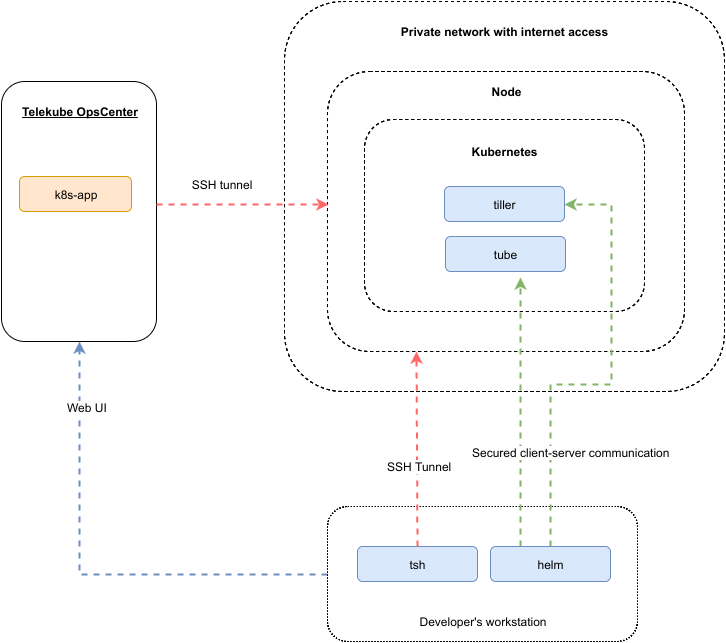

# Jenkins pipelines on Telekube

This document describes how to use Jenkins pipelines with [Telekube](http://gravitational.com/docs/overview/).

## Glossary

* `Jenkins` - open source automation server, see https://jenkins.io/.
* `Telekube OpsCenter` - application catalog, which keeps Kubernetes package for deployment on any infrastructure. Part of [telekube](http://gravitational.com/docs/overview/).
* `tube` - Kubernetes charts repository application.
* `tsh` - used to login into remote SSH nodes, part of [teleport](http://gravitational.com/teleport/).
* `helm` - client for managing Kubernetes charts and repositories, part of [helm](https://github.com/kubernetes/helm).
* `tiller` - server for executing deployments throught Kubernetes API, part of [helm](https://github.com/kubernetes/helm).
* Kubernetes charts - packages of pre-configured Kubernetes resources.

## General scheme



To achieve the same result, you must complete several actions.

On infrastructure side:
* Get `Telekube OpsCenter` up and running.
**TODO** where install tube?
* Deploy `tube` on opscenter node, add Jenkins Chart to it.
* Create cluster using `k8s` application, you can use on-premisise or AWS infrastructure. It will spin up kubernetes and `tiller` inside it.

Details are not presented, because these parts are closed-source.

On user-side:
* Download `helm`, use latest master from sources https://github.com/kubernetes/helm.
* Download `tsh`, see http://gravitational.com/teleport/docs/quickstart.

## Use helm with cluster

Initialize `helm` on local machine:

```shell
helm init --client-only
```

Then add `tube` repository to local helm repositories:

**TODO**: add info how to get proper certificates

```shell
helm repo add --ca-file="$HELM_CERTPATH/ca-tube.gravitational.io.pem" \
    --cert-file="$HELM_CERTPATH/client-tube.gravitational.io.pem \
    --key-file="$HELM_CERTPATH/client-key-tube.gravitational.io.pem" \
    tube.gravitational.io https://tube.gravitational.io:443/charts
helm repo update
```

Install jenkins using `tube` repository

**TODO** whats the url of tube?

```shell
helm install --debug -f chart-values/jenkins-values.yaml tube/jenkins
```

After installation some NOTES will be shown -- read it carefully.

## Using Jenkins

**TODO** add info how jenkins works with pipelines and how to build and deploy app
